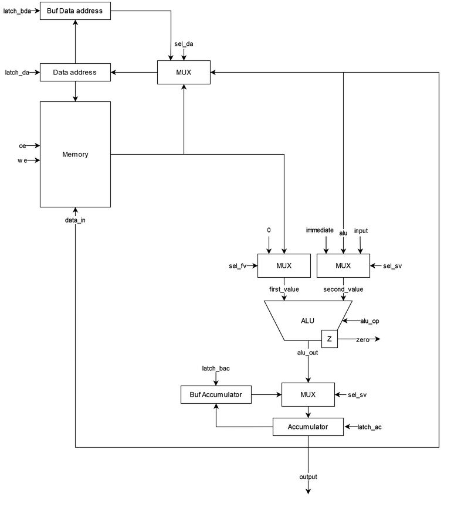
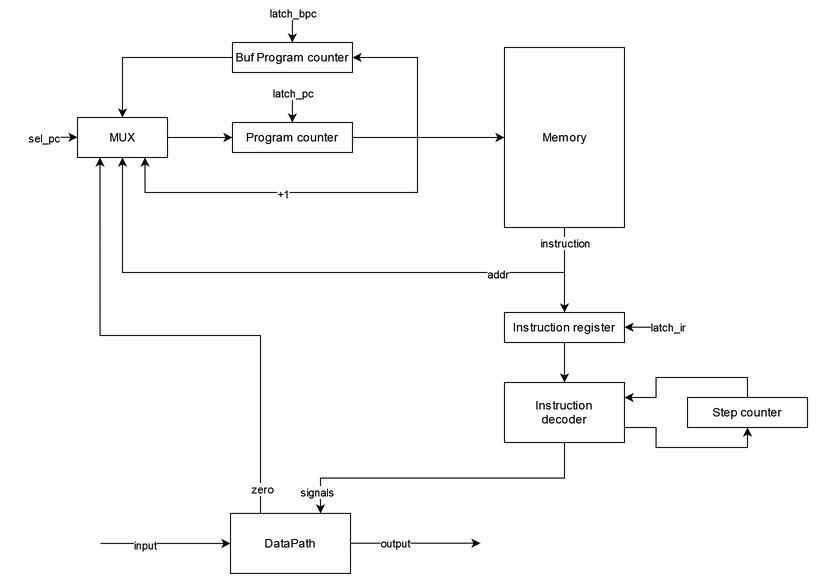

# Архитектура компьютера. Лабораторная работа 3

- Шерстобитов Артем Витальевич, P3221
- `asm | acc | neum | hw | tick -> instr | struct | trap -> stream | port | pstr | prob1 | cache`
- Базовый вариант

## Язык программирования
``` ebnf
program ::= [code_part] [data_part]

data_part ::= ".data:" [comment] "\n" {data_line} 

data_line ::= name data [comment] "\n"

data ::= "NUMBER" number 
       | "STRING" string
       | "BUFFER" number
       | "VECTOR" string

code_part ::= ".code:" [comment] "\n" {code_line}

code_line ::= label [comment]
            | instr [comment]
            | [comment] "\n"
            
label ::= name ":" "\n"

instr ::= op0
        | op1
        
op0 ::= "HALT"
      | "NOP"
      | "RET"
      | "LOAD_AC"
      | "SAVE_AC"
      | "INC"
      | "INPUT"
      | "OUTPUT"
      
op1 ::= "JUMP" name
      | "JZ" name
      | "LOAD" name
      | "PUSH" name 
      | "PUSH" number 
      | "SET_DA" name 
      | "ADD" name 
      | "SUB" name 
      | "MOD" name 
      | "CMP" name 
        
comment ::= ";" {<any except "\n">}

number ::= ["-"] { <any of "0-9"> }

name ::= <any of "a-z A-Z _"> { <any of "a-z A-Z 0-9 _"> }

string ::= {<any except "\n" ";">}
```

_Операции потока программы_
- `HALT` - стоп программы
- `JUMP` - перейти к метке (адресу)
- `JZ` - перейти к метке (адресу), если установлен флаг `zero`
- `NOP` - пустышка
- `RET` - выйти из прерывания и восстановить контекст

_Операции работы с аккумулятором_
- `LOAD` - загрузить в аккумулятор значение из памяти
- `SAVE` - сохранить в память значение из аккумулятора
- `PUSH` - загрузить значение в аккумулятор или адрес переменной
- `SET_DA` - установить `data_address` из памяти
- `LOAD_AC` - сохранить значение по адресу из аккумулятора
- `SAVE_AC` - загрузить значение в память из аккумулятора по адресу в `data_address`

_Арифметические операции_
- `INC` - увеличить на один значение в аккумуляторе
- `ADD` - добавить значение из памяти к аккумулятору
- `SUB` - вычесть значение из памяти из аккумулятора
- `MOD` - найти остаток от деления аккумулятора на значение из памяти

_Операции работы с I\O_
- `INPUT` - считать значение из внешнего устройства (в прерывании)
- `OUTPUT` - вывести значение на внешнее устройство

_Типы данных_
- `STRING` - p-string (длина строки + сама строка)
- `BUFFER` - буфер заполненный нулями
- `NUMBER` - целое число
- `VECTOR` - обозначить метку как обработчик прерываний

Особенности: 
- Код выполняется последовательно
- При трансляции все метки в коде заменяются на соответствующие адреса
- Память выделяется и заполняется начальными значениями статически при запуске модели
- Видимость данных - глобальная
- Литералы:
  - Целое число
  - Строка
- Комментарии после символа `;`
- С помощью `VECTOR` можно пометить метку обработчиком прерывания
- Обработчик прерывания - это обычный код. Пишется программистом
- Программа исполняется с нулевого адреса

## Организация памяти
Модель памяти процессора:
- Архитектура фон Неймана - общая память для данных и команд
- Память:
  - Машинное слово - словарь `{"index": value, "opcode": value, "value": value}`
  - Линейное адресное пространство
  - Реализуется списком словарей
  - Числа 32 бит
- Адресация абсолютная (`JUMP` `JZ`)
- Прямая загрузка (`PUSH`)
- Для реализации прерываний присутствуют специальные регистры, в которых хранятся значения регистров сохраненного контекста
- Флаг `zero` - проверяет, что последняя операция дала результат ноль

Модель памяти:
- При запуске программы память выделяется статически, общая память для данных и команд
- Система команд построена вокруг аккумулятора, поэтому большинство инструкции взаимодействуют с ним
- Все регистры вспомогательные, доступ есть только к `accumulator` и `data address`
- Можно осуществлять чтение и запись в память
- Статические данные хранятся в памяти вместе с инструкциями
- К динамическим данным можно отнести загруженные с помощью `PUSH`, которые загружаются в аккумулятор
- Прерывания - это ссылка на метку. Возврат из прерывания - это инструкция `RET`
- При трансляции определяется вектор прерываний
```text
            Registers
+------------------------------+
| accumulator                  |
+------------------------------+
+------------------------------+
| data address                 |
+------------------------------+

            Memory
+------------------------------+
| 00  : program start          |
| 01  : instruction            |
|    ...                       |
|    ...                       |
| 10  : interrupt instruction  |
| 11  : RET                    |
|    ...                       |
|  n  : HLT                    |
| 00  : value                  |
| 01  : value                  |
|    ...                       |
| l+0 : string len             |
| l+1 : string value           |
|    ...                       |
| c+0 : buffer \0              |
| c+1 : buffer \0              |
|    ...                       |
+------------------------------+
```

- Литералы загружаются на стек с помощью `PUSH`
- Литералы изначально находятся в статической памяти, если объявлены в разделе `.data`
  - Порядок такой же как при объявлении
- `STRING` хранятся по символу в машинном слове, строке предшествует её длина
- `BUFFER` занимает соответсвующее длине число ячеек, изначально заполнен нулями
- Констант нет, любое машинное слово может быть изменено
- Переход к следующей инструкции осуществляется
  - Последовательно
  - Безусловно - `JMP`
  - Условно -`JZ`
  - При прерывании, `RET`
- Прерывания 
  - Объявляются в секции `.data` с помощью указания `VECTOR` с меткой 
  - Хранятся в памяти вместе с другими инструкциями и данными
  - Начало определяется меткой, к которой переходит процессор при возникновении прерывания, при этом необходимые регистры сохраняются в буферные регистры
  - Конец - `RET`

## Система команд 
Особенности процессора
- Машинное слово - 32 бита, знаковое. Только абсолютная адресация
- Все данные представлены целым числом, поэтому с ними можно работать как с числом
- Для программиста доступны `accumulator` и `data address`. Присутсвуют специальные вспомогательные регистры
  - `program_counter` - хранит адрес следующей инструкции
  - `instruction_register` - хранит текущую инструкцию
  - `step counter` - хранит номер такта текущей инструкции (для многотактовых инструкций)
  - `data_address` - указатель на ячейку памяти данных
- Буферные регистры для сохранения контекста:
  - `buf data address` - хранит значение `data address` до прерывания 
  - `buf accumulator` - хранит значение `accumulator` до прерывания
  - `buf program counter` - хранит значение `program counter` до прерывания
- Доступ к памяти из `DataPath` осуществляется по адресу, хранящемуся в регистре `data address`
- Доступ к памяти из `Control Unit` осуществляется по адресу, хранящемуся в регистре `program counter`
  - Установка адреса осуществляется путём автоматического инкрементирования или с помощью команд управления потоком программы
- Обработка данных:
  - Арифметические операции над значением в аккумуляторе
  - Операциями ввода/вывода
- Ввод/вывод происходит с аккумулятором, через порт ввода/вывода соответственно
  - Порты реализованы с помощью списка чисел
- Поток управления:
  - Автоинкремент `Program counter`
  - Безусловный переход - `JMP` 
  - Условный переход - `JZ`, если установлен флаг `zero`
  - Прерывания, `RET`
  - `HALT` - остановка программы

### Набор инструкций
Все инструкции языка напрямую отображаются в инструкции процессора, за исключением инструкций выделения памяти для данных

Первый такт - всегда выборка инструкции IR = M[PC]

Обозначения:
- M - memory
- IR - instruction registry
- DA - data address 
- PC - program counter
- Z - zero flag 
- AC - accumulator
- IN - input port
- OUT - output port

Инструкции управления потоком программы

| Инструкция    | Кол-во тактов | Описание                            |
|---------------|:-------------:|-------------------------------------|
| `HALT`        |       2       | Остановка программы                 |
| `JUMP` [addr] |       2       | PC = PM[PC]                         |
| `JZ` [addr]   |       2       | IF Z: PC = PM[PC] ELSE: PC = PC + 1 |
| `RET`         |       2       | Восстановление контекста            |
| `NOP`         |       2       | Пустышка                            |

Инструкции работы с аккумулятором

| Инструкция      | Кол-во тактов | Описание                           |
|-----------------|:-------------:|------------------------------------|
| `LOAD` [addr]   |       3       | DA = M[PC], AC = M[DA]             |
| `SAVE` [addr]   |       3       | DA = M[PC], M[PC] = AC             |
| `PUSH` [value]  |       2       | AC = M[PC]                         |
| `SET_DA` [addr] |       3       | DA = M[PC], DA = M[DA]             |
| `LOAD_AC`       |       3       | DA = AC, AC[DA]                    |
| `SAVE_AC`       |       2       | M[DA] = AC                         |

Инструкции арифметики

| Инструкция | Кол-во тактов | Описание                    |
|------------|:-------------:|-----------------------------|
| `INC`      |       2       | AC = AC + 1                 |
| `ADD`      |       3       | DA = M[PC], AC = AC + M[DA] |
| `SUB`      |       3       | DA = M[PC], AC = AC - M[DA] |
| `MOD`      |       3       | DA = M[PC], AC = AC % M[DA] |
| `CMP`      |       2       | ZERO = AC == PC             |

Инструкции работы с I/O

| Инструкция    | Кол-во тактов | Описание |
|---------------|:-------------:|----------|
| `INPUT`       |       2       | AC = IN  |
| `OUTPUT`      |       2       | OUT = AC |

### Кодирование инструкций
- Машинный код сериализуется в список JSON в виде словарей `{"index": value, "opcode": value, "value": value}`
- Один элемент списка -- одна инструкция.
- Индекс списка -- адрес инструкции. Используется для команд перехода.
- Все инструкции данных заменяются на соответсвующее данные
- Вместо меток подставляется адрес в памяти команд

Пример:
```
[{"name": "int0", "opcode": "VECTOR", "value": 10},
 {"index": 0, "opcode": "LOAD", "value": 13},
 {"index": 1, "opcode": "CMP", "value": 9999},
 {"index": 2, "opcode": "JZ", "value": 0},
 {"index": 3, "opcode": "LOAD", "value": 13},
 {"index": 4, "opcode": "JZ", "value": 9},
 {"index": 5, "opcode": "OUTPUT", "value": null},
 {"index": 6, "opcode": "PUSH", "value": 9999},
 {"index": 7, "opcode": "SAVE", "value": 13},
 {"index": 8, "opcode": "JUMP", "value": 0},
 {"index": 9, "opcode": "HALT", "value": null},
 {"index": 10, "opcode": "INPUT", "value": null},
 {"index": 11, "opcode": "SAVE", "value": 13},
 {"index": 12, "opcode": "RET", "value": null},
 {"index": 13, "opcode": "NUMBER", "value": 9999}]
```
- `index` - адрес в памяти 
- `opcode` - строка с кодом операции
- `value` - аргумент

В модуле [isa.py](./machine/isa.py) тип данных `Opcode` - перечисление кодов операций

### Прерывания
Ввод осуществляется токенами через систему прерываний. Логика работы:
- При старте модели есть расписание ввода (`[(1, 'h'), (10, 'e'), (20, 'l'), (25, 'l'), (100, 'o')]`, где цифра -- момент поступления данных, символ -- токен);
- Прерывания считаем внутренними
- Обработчик прерывания реализуется программистом 
- В процессе моделирования идёт отсчёт времени в тактах, по наступлении события ввода -- происходит обработка прерывания
- Вывод данных реализуется посимвольно, как в варианте `stream`, по выполнении команд в буфер вывода добавляется ещё один символ;
- Обработчик прерывания обозначается меткой с указанием `VECTOR` в части `.data` 
- Конец обработчика прерывания - инструкция `RET`
- Во время прерывания другие прерывания не происходят, поэтому могут потеряться некоторые токены
- Прерывание происходит не на любом такте, а при выборке инструкции (когда `step counter` == 0)

## Транслятор
Интерфейс командной строки:
```
usage: translator.py [-h] source_file target_file
                                                 
Трансляция кода                                  
                                                 
positional arguments:                            
  source_file  Имя файла с кодом                 
  target_file  Имя выходного файла

options:
  -h, --help   show this help message and exit 
```
Реализовано в модуле [translator.py](./translator.py)

Принципы работы:
- Пустые строки или только с комментариями пропускаются
- Комментарии в строках отсекаются
- Два прохода: разделение на токены и отображение в машинный код (словари)
- Проверяется, что числа в допустимом диапазоне
- Проверяется корректное число токенов в строке
- Проверяется, что метки и имена переменных не были переопределены
- Отдельная обработка сначала `.code`, затем `.data`
- `.data`:
  - Разделение на 3 токена по первым 2 пробелам
  - Замена на данные по типу данных
     - `NUMBER` - по значению
     - `STRING` - каждый символ = одно машинное слово, строке предшествует её длина
     - `BUFFER` - заменяется на n `\0`
     - `VECTOR` - указывает на адрес обработчика прерываний
  - Сохранение адреса переменной для последующей замены обращений по имени
  - Первым словом записывается `VECTOR` для указания на обработчик прерываний
- `.code`
  - Если оканчивается на `:` - метка, сохраняется адрес для последующей замены обращений по имени
  - Инструкции без аргументов имеют аргумент `None`

## Модель процессора
Интерфейс командной строки:
```
usage: simulation.py [-h] [--debug_limit DEBUG_LIMIT] [--limit LIMIT] code_file [input_file]

Симуляция процессора

positional arguments:
  code_file             Имя файла бинарным с кодом
  input_file            Имя входного файла (опционально)

options:
  -h, --help            show this help message and exit
  --debug_limit DEBUG_LIMIT
                        Лимит отладки (по умолчанию 200)
  --limit LIMIT         Лимит тиков (по умолчанию 100000)
```

Реализован в модуле: [simulation.py](./simulation.py)
- Аккумуляторная архитектура
- Архитектура фон Неймана
- Прерывания

### DataPath


Реализован в классе `Datapath` в модуле [datapath.py](./machine/datapath.py)
- Управляющие сигналы приходят от `ControlUnit`
- Сигналы реализованы в виде методов класса
- `Memory` - однопортовая память: либо читаем, либо пишем
- `ALU` - АЛУ для выполнения арифметических операций
- `Data register` - указатель на данные
- `immediate` - прямое значение из инструкции
- `input`/`output` - порты ввода/вывода
- `Buf *` - буферные регистры для сохранения контекста

Сигналы:
- `latch_*` - защёлкнуть соответствующий регистр
- `sel_*` - выбрать значение на соответсвующее мультиплексоре
- `we` - активна запись в память
- `oe` - активно чтение из памяти
- `alu_op` - выбор арифметической операции

Флаги:
- `zero` - для проверки вершины стека на ноль



Реализован в классе `ControlUnit` в модуле [control_unit.py](./machine/control_unit.py)   
- Сигналы реализованы в виде методов класса
- Управление сигналами сделано на уровне языка Python (hardwired)
- Цикл процессора реализован в методе `decode_and_execute`
  1. Проверка `step counter`
  2. Проверка `opcode`
  3. Отправка сигналов
- `Memory` - только читаем
- `Program counter` - указатель на следующую инструкцию
- `Buf program counter` - для сохранения контекста
- `Instruction register` - хранит текущую инструкцию
- `Instruction decoder` - декодирует опкод операции и отправляет сигналы
- `Step counter` - хранит текущий шаг инструкции
- `input`/`output` - порты ввода/вывода

Сигналы:
- `latch_*` - защёлкнуть соответствующий регистр
- `sel_*` - выбрать значение на соответсвующее мультиплексоре
- `zero` - флаг нуля из `Datapath`

Особенности работы модели:
- Подготовка и запуск модели происходит в методе `simulation` в модуле [simulation.py](./simulation.py)
- Шаг моделирования равен одному тику процессора
- Для журнала состояний процессора используется стандартный модуль `logging`
  - Текущий тик
  - Текущая инструкция
  - Состояние регистров
  - Флаг `zero`
  - Идет ли прерывание
- Количество инструкций для моделирования и логирования лимитировано
- Остановка моделирования осуществляется:
  - При превышении лимита количества выполняемых инструкций;
  - При исключении `EOFError` -- если нет данных для чтения из порта ввода;
  - При исключении `StopIteration` -- если выполнена инструкция `HALT`.

## Тестирование
Тестирование выполняется при помощи golden test-ов

- Реализованные программы лежат в [code](./code)
- Предлагаемые входные данные лежат в [inputs](./inputs)
- Конфигурации golden test-ов лежат в [golden](./golden) в виде файлов формата _.yml_
  - Код программы
  - Мнемоники машинного кода
  - Машинный код 
  - Выходные данные
  - Журнал работы процессора

Алгоритмы:
  - [cat](./golden/cat.yml) - вывод потенциально бесконечных входных данных
  - [cat_fast](./golden/cat_fast.yml) - вывод потенциально бесконечных входных данных, но с короткими промежутками между токенами (часть теряется)
  - [hello](./golden/hello.yml) - вывод сообщения
  - [hello_user](./golden/hello_user.yml) - вывод приветствия пользователя с учетов ввода
  - [prob1](./golden/prob1.yml) - алгоритм на работу с числами

Запустить тесты: `poetry run pytest . -v`

Обновить конфигурацию golden tests: `poetry run pytest . -v --update-goldens`

Разбор теста `cat` ([cat](./golden/cat.yml))
- Код программы
```text
.code:                      ; начало секции кода

wait_loop:                  ; метка (ожидаем прерывание)
    LOAD inp                ; загружаем переменную `inp` в аккумулятор
    CMP 9999                ; сравниваем с `9999` (устанавливается флаг `zero`)
    JZ wait_loop            ; условный переход к метке (если прерывание не записало символ)
    
    LOAD inp                ; загружаем переменную `inp` в аккумулятор
    JZ end                  ; условный переход к метке (если прерывание записало символ `\0`)
    OUTPUT                  ; вывод аккумулятора    
    PUSH 9999               ; записать в аккумулятор `9999`
    SAVE inp                ; сохраняем переменную `inp` из аккумулятор
    JUMP wait_loop          ; безусловный переход к метке

end:                        ; метка (конец)
    HALT                    ; остановка программы

interrupt0:                 ; метка (вектор прерывания)
    INPUT                   ; считываем символ с внешнего устройства в аккумулятор
    SAVE inp                ; сохраняем переменную `inp` из аккумулятор
    RET                     ; восстановление контекста

.data:                      ; начало секции данных
    int0 VECTOR interrupt0  ; объявляем метку `interrupt0` обработчиком прерываний
    inp NUMBER 9999         ; переменна типа `NUMBER` со значением `9999`
```
- Вывод транслятора
```
python .\translator.py .\code\cat.txt .\out\cat.out
LoC: 26 code_instr: 15
```
- Машинный код (до перевода в бинарный формат)
```text
[{"name": "int0", "opcode": "VECTOR", "value": 10}, - обработчик прерывания
 {"index": 0, "opcode": "LOAD", "value": 13},       - инструкция
 {"index": 1, "opcode": "CMP", "value": 9999},      - инструкция
 {"index": 2, "opcode": "JZ", "value": 0},          - инструкция
 {"index": 3, "opcode": "LOAD", "value": 13},       - инструкция
 {"index": 4, "opcode": "JZ", "value": 9},          - инструкция
 {"index": 5, "opcode": "OUTPUT", "value": null},   - инструкция
 {"index": 6, "opcode": "PUSH", "value": 9999},     - инструкция
 {"index": 7, "opcode": "SAVE", "value": 13},       - инструкция
 {"index": 8, "opcode": "JUMP", "value": 0},        - инструкция
 {"index": 9, "opcode": "HALT", "value": null},     - инструкция
 {"index": 10, "opcode": "INPUT", "value": null},   - инструкция
 {"index": 11, "opcode": "SAVE", "value": 13},      - инструкция
 {"index": 12, "opcode": "RET", "value": null},     - инструкция
 {"index": 13, "opcode": "NUMBER", "value": 9999}]  - данные
```
- Вывод процессора (логирование уровня INFO)
```
python .\simulation.py .\out\cat.out .\inputs\name.txt
INFO:root:Start simulation
INFO:root:Interrupt!
INFO:root:input: A
INFO:root:output: A << 65
INFO:root:Interrupt!
WARNING:root:Debug limit exceeded!
INFO:root:input: r
INFO:root:output: Ar << 114
INFO:root:Interrupt!
INFO:root:input: t
INFO:root:output: Art << 116
INFO:root:Interrupt!
INFO:root:input: e
INFO:root:output: Arte << 101
INFO:root:Interrupt!
INFO:root:input: m
INFO:root:output: Artem << 109
INFO:root:Interrupt!
INFO:root:input:
INFO:root:output_buffer: Artem
INFO:root:End simulation
Artem
Instructions: 270 Ticks: 621
```
- Журнал работы, логирование уровня DEBUG (часть)
```
python .\simulation.py .\out\cat.out .\inputs\name.txt
INFO:root:Start simulation
DEBUG:root:Tick:    0 NOP     SC:   0 PC:   0 AC:    0 DA:   0 ZERO: 0 INTERRUPTED: 0
DEBUG:root:Tick:    0 LOAD    SC:   1 PC:   1 AC:    0 DA:   0 ZERO: 0 INTERRUPTED: 0
DEBUG:root:Tick:    1 LOAD    SC:   2 PC:   1 AC:    0 DA:  13 ZERO: 0 INTERRUPTED: 0
DEBUG:root:Tick:    2 LOAD    SC:   0 PC:   1 AC: 9999 DA:  13 ZERO: 0 INTERRUPTED: 0
DEBUG:root:Tick:    3 CMP     SC:   1 PC:   2 AC: 9999 DA:  13 ZERO: 0 INTERRUPTED: 0
DEBUG:root:Tick:    4 CMP     SC:   0 PC:   2 AC: 9999 DA:  13 ZERO: 1 INTERRUPTED: 0
DEBUG:root:Tick:    5 JZ      SC:   1 PC:   3 AC: 9999 DA:  13 ZERO: 1 INTERRUPTED: 0
DEBUG:root:Tick:    6 JZ      SC:   0 PC:   0 AC: 9999 DA:  13 ZERO: 1 INTERRUPTED: 0
DEBUG:root:Tick:    7 LOAD    SC:   1 PC:   1 AC: 9999 DA:  13 ZERO: 1 INTERRUPTED: 0
DEBUG:root:Tick:    8 LOAD    SC:   2 PC:   1 AC: 9999 DA:  13 ZERO: 1 INTERRUPTED: 0
DEBUG:root:Tick:    9 LOAD    SC:   0 PC:   1 AC: 9999 DA:  13 ZERO: 0 INTERRUPTED: 0
DEBUG:root:Tick:   10 CMP     SC:   1 PC:   2 AC: 9999 DA:  13 ZERO: 0 INTERRUPTED: 0
DEBUG:root:Tick:   11 CMP     SC:   0 PC:   2 AC: 9999 DA:  13 ZERO: 1 INTERRUPTED: 0
DEBUG:root:Tick:   12 JZ      SC:   1 PC:   3 AC: 9999 DA:  13 ZERO: 1 INTERRUPTED: 0
DEBUG:root:Tick:   13 JZ      SC:   0 PC:   0 AC: 9999 DA:  13 ZERO: 1 INTERRUPTED: 0
DEBUG:root:Tick:   14 LOAD    SC:   1 PC:   1 AC: 9999 DA:  13 ZERO: 1 INTERRUPTED: 0
DEBUG:root:Tick:   15 LOAD    SC:   2 PC:   1 AC: 9999 DA:  13 ZERO: 1 INTERRUPTED: 0
DEBUG:root:Tick:   16 LOAD    SC:   0 PC:   1 AC: 9999 DA:  13 ZERO: 0 INTERRUPTED: 0
DEBUG:root:Tick:   17 CMP     SC:   1 PC:   2 AC: 9999 DA:  13 ZERO: 0 INTERRUPTED: 0
DEBUG:root:Tick:   18 CMP     SC:   0 PC:   2 AC: 9999 DA:  13 ZERO: 1 INTERRUPTED: 0
DEBUG:root:Tick:   19 JZ      SC:   1 PC:   3 AC: 9999 DA:  13 ZERO: 1 INTERRUPTED: 0
DEBUG:root:Tick:   20 JZ      SC:   0 PC:   0 AC: 9999 DA:  13 ZERO: 1 INTERRUPTED: 0
```

### CI
CI при помощи Github Action

[python.yml](./.github/workflows/python.yml)
- `poetry` - управления зависимостями для языка программирования Python.
- `coverage` - формирование отчёта об уровне покрытия исходного кода.
- `pytest` - утилита для запуска тестов.
- `ruff` - утилита для форматирования и проверки стиля кодирования.

Запускается при пуше в репозиторий на ветку мастер
Тестовые процессы
- `test` - запуск тестов
- `lint` - запуск линтера

### Для сбора аналитики

| ФИО                          | алг             | LoC | code байт | code инстр. | инстр. | такт. | вариант                                                                       |
|:-----------------------------|:----------------|:----|:----------|:------------|:-------|:------|:------------------------------------------------------------------------------|
| Шерстобитов Артем Витальевич | cat             | 26  | -         | 15          | 270    | 621   | `asm - acc - neum - hw - tick - struct - trap - port - pstr - prob1 - cache`  |
| Шерстобитов Артем Витальевич | hello           | 26  | -         | 28          | 140    | 355   | `asm - acc - neum - hw - tick - struct - trap - port - pstr - prob1 - cache`  |
| Шерстобитов Артем Витальевич | hello_user_name | 69  | -         | 101         | 375    | 896   | `asm - acc - neum - hw - tick - struct - trap - port - pstr - prob1 - cache`  |
